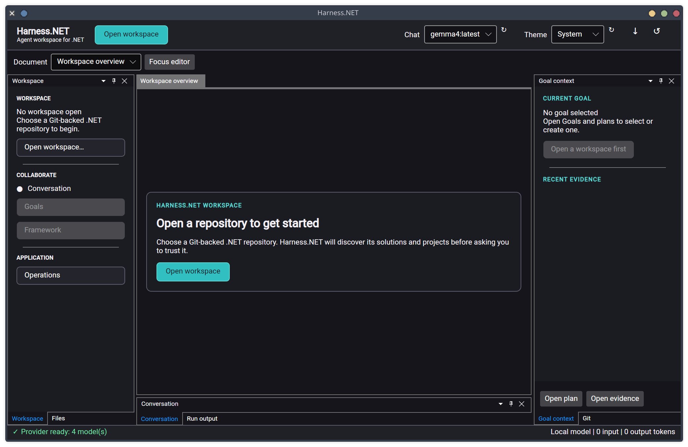
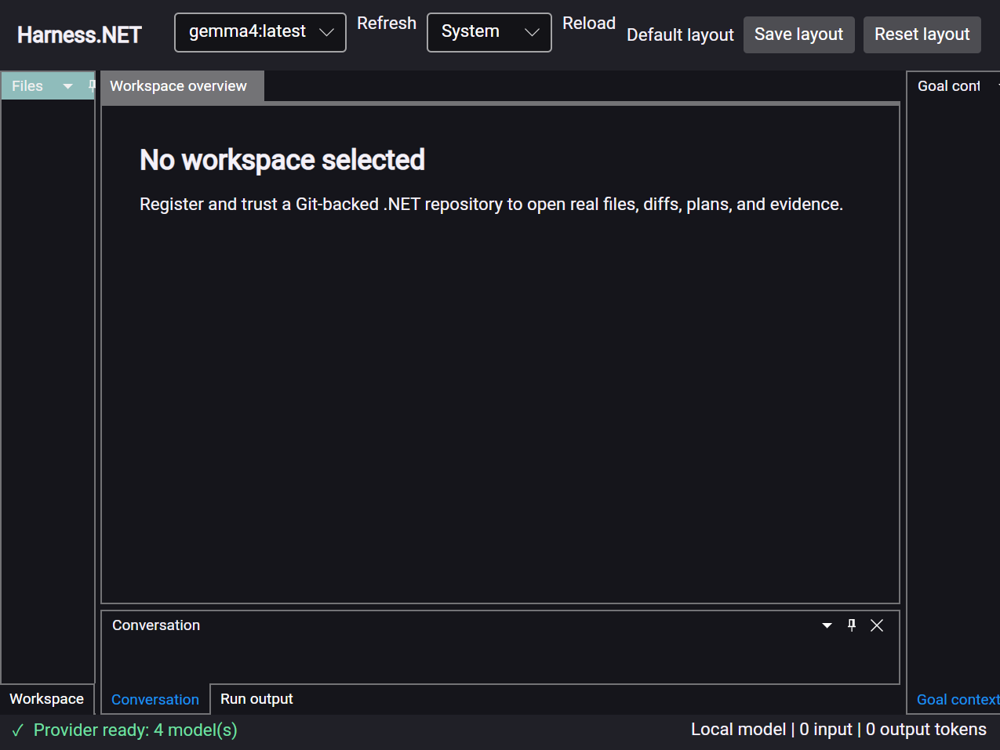

# Docked workbench acceptance — 2026-07-29

The Linux x64 Avalonia host ran with empty isolated XDG configuration, data, and state.
No workspace, goal, conversation, evidence, or diagnostics were preloaded.

## Visual review

- At 2084×1358 captured pixels, Workspace/Files, Goal context, Conversation, Run
  output, and the central document region were visible. Header commands fit.
- At 1319×1040 captured pixels on the scaled desktop, side and bottom content
  collapsed behind Dock tabs and the document remained readable. Commands remained
  reachable.

Follow-up changes added the centered Open workspace card, native folder picker with
manual path fallback, hierarchical Git-tracked Files tree, compact layout controls,
and theme-bound conversation cards. Folder selection did not grant trust.

## Deterministic UI checks

`Harness.Presentation.Avalonia.Tests` verifies:

- opened AvaloniaEdit content belongs to the rendered window tree;
- default-layout replacement retains the seven tool controls;
- tracked paths form a directory-first tree and filtering keeps hierarchy;
- conversation cards update with theme resources;
- Ctrl+Shift+E, Ctrl+Shift+G, Ctrl+J, and F6 restore compact tools;
- focus targets and automation names;
- floating-window ownership and layout recovery;
- 200% framebuffer scaling doubles pixels without changing logical layout.

## AT-SPI and Orca

`./eng/verify-avalonia-atspi.py` runs against `Harness.Host --ui=avalonia` with a
temporary Git repository and isolated XDG state. It:

1. registers, selects, and trusts the repository;
2. creates a local-only goal and approves a manual plan and worktree;
3. opens and edits two worktree documents;
4. searches tracked text;
5. saves layout, restarts, and verifies restoration;
6. injects invalid layout state, restarts, and verifies default fallback.

The script restores desktop accessibility settings and removes temporary files. It
performs no model call.

`./eng/verify-avalonia-atspi.py --with-orca` runs Orca 50.2 with an isolated profile.
It refuses to replace an existing Orca process and rejects speech containing known
Avalonia or Dock implementation type names. The passing trace included application
labels for the conversation model, editor documents, layout save, Workspace tab,
workspace manager, repository path, folder picker, and inspection action. This checks
generated speech output, not human comprehension.

## Complete goal workflow

`./eng/verify-avalonia-workflow.py` uses a deterministic loopback Ollama HTTP server.
It exercises the real UI, provider adapter, typed tools, Git worktree, and SQLite
state without external inference.

The verifier:

1. registers and trusts a temporary .NET repository;
2. runs Lead planning after an `inspect_dotnet` call;
3. stops at `AwaitingPlanApproval`, verifies SQLite, restarts, and approves;
4. applies an exact-baseline `Program.cs` edit;
5. records successful Build and Test evidence;
6. runs Reviewer after Git diff and evidence inspection;
7. creates and separately approves an exact-diff commit request.

Assertions require the original repository and one-commit `main` history to remain
unchanged. The isolated branch must be clean with one additional commit and a
`Harness-Diff-SHA256` trailer. SQLite must contain the expected nine checkpoints,
successful FileEdit/Build/Test evidence, and the commit SHA. The provider/tool
sequence is exact; a text-only response cannot pass.
