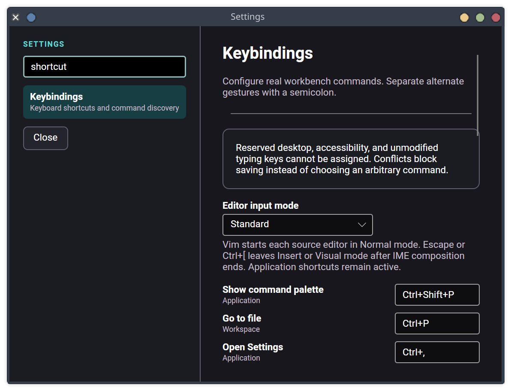

# Editor keybinding acceptance — 2026-08-13

This record covers the configurable-keybinding portion of Task 049 item 6. The
separate Vim acceptance record now completes the modal-input portion.

## Delivered behavior

- Business Logic owns 21 closed shell, panel, accessibility, document, navigation,
  and transformation commands plus typed keys and modifiers.
- One immutable snapshot drives shell and source-editor dispatch, the command palette,
  the header hint, and source-toolbar shortcut tips. Changing a saved gesture changes
  behavior and discovery together without restarting.
- A command may be deliberately unbound or have up to eight alternate gestures.
- Whole-set validation reports malformed gestures, repeated command entries,
  duplicates, cross-command conflicts, missing commands, unknown commands, and
  protected shortcuts. Save remains unavailable while a conflict exists.
- Unmodified typing/navigation/Escape, desktop close/session/lock combinations, and
  Linux virtual-terminal combinations remain owned by the focused control or system.
- Reset restores the built-in catalog. Corrupt or obsolete stored configuration
  reports the rejection and activates safe defaults.
- Import accepts only a 65,536-character bounded `harness-keybindings-v1` JSON object
  with exact properties, known commands, and string gestures. Unknown properties,
  formats, command IDs, scripts, paths, and arbitrary actions are rejected. Export is
  an explicit clipboard action.
- SQLite schema 28 stores the normalized private preference. Backup/restore includes
  it through the existing application database and the upgrade test covers the new
  migration.

The architecture boundary and the safety requirements for the later modal input
slice are fixed by [ADR 021](../decisions/021-typed-keybindings-and-modal-input.md).

## Deterministic evidence

Focused policy and storage tests cover defaults, alternate gestures, normalization,
custom save/reset, strict JSON round-trip and rejection, conflict/reservation/missing
command checks, corrupt-state fallback, atomic SQLite persistence, and invalid-row
rejection.

Headless Avalonia tests cover:

- Settings discovery and accessible names;
- live conflict text disabling Save;
- visible reset and safe import/export actions;
- exact typed input mapping;
- a custom completion gesture replacing `Ctrl+Space` in a real source editor;
- the toolbar showing that same custom gesture;
- compact workbench panel restoration through the shared configurable dispatcher.

`./eng/verify-editor-intelligence.py --no-build` passed in 93.0 seconds:

- 47 Roslyn adapter tests;
- 21 semantic-boundary tests;
- 42 transformation-authority tests;
- 8 editor-settings policy tests;
- 3 editor-settings storage tests;
- 70 editor-control tests;
- 2 theme-contract tests.

The production AT-SPI verifier passed, as did the self-contained Linux x64 publish;
the published host reported `Harness.NET ready (schema 28)`.

The complete solution test run passed all 682 tests: 6 analyzer, 1 architecture, 263
Business Logic, 229 Data Access, 22 Host, 137 Avalonia Presentation, 22 Terminal
Presentation, and 2 Avalonia toolkit tests. The solution build completed with zero
warnings.

## Visual inspection

The production Settings window was launched with isolated XDG state and driven through
AT-SPI. The captured 980×700 view shows the searchable Keybindings category, safety
message, command/category labels, and editable active gestures:

The page scrolls through all commands to validation, save/reset, and the bounded JSON
transfer controls. It uses the established Settings layout and accessible control
names; no separate modal editor or fake state was introduced.

## Remaining Task 049 work

- project User Secrets with masked and separately authorized developer actions;
- Task 052-backed typed Run/Debug CodeLens targets;
- final Task 049 performance, cancellation, large-solution, repeated-context,
  keyboard-only, IME, Orca, scaling, restoration, and parity audit.
