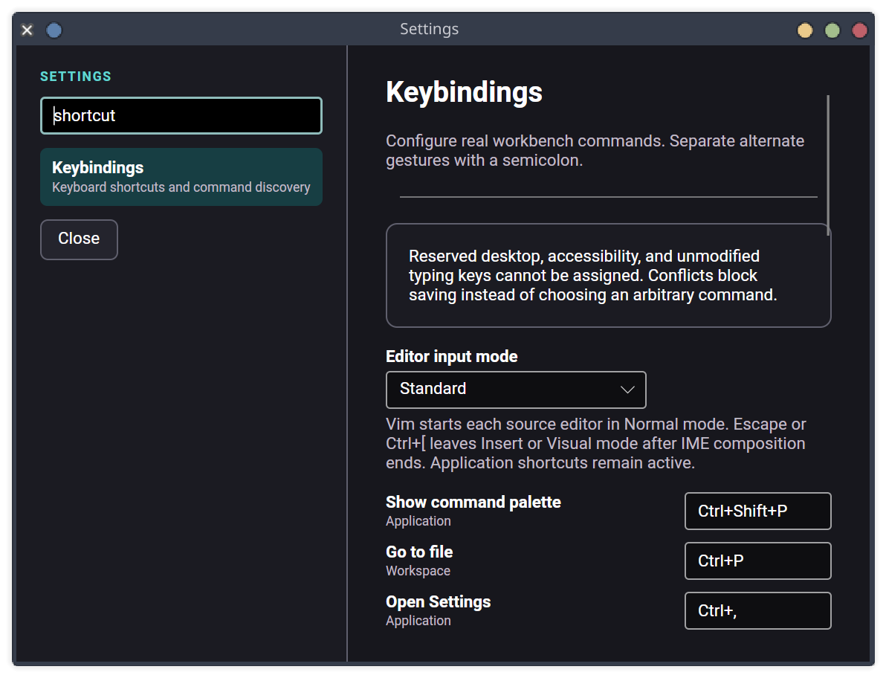

# Optional Vim editor input — 2026-08-13

This record covers the optional Vim portion of Task 049 criterion 7. Standard input
remains the default.

## Delivered behavior

- Settings persists a closed `Standard` or `Vim` input mode in SQLite schema 29.
  Changes apply to open and future source editors without restart. Resetting or
  importing keybindings does not silently change the input mode.
- Each source document owns independent Normal, Insert, Visual, or Visual Line state
  over the existing AvaloniaEdit buffer. The mode, count, and pending operator appear
  beside the caret position. No second editor or Roslyn session exists.
- Counted core motions are `h/j/k/l`, `w/b/e`, `0/$`, and `gg/G`. Insert entry is
  `i/a/I/A/o/O`. Operators and changes are `x/X`, `d/y/c`, `D/C/Y`, `p/P`,
  `u`/`Ctrl+R`, and character/line selections through `v/V`.
- Yank and delete update both a document-local Vim register and the desktop clipboard.
  Editing still uses the ordinary undoable live buffer, dirty-state, diagnostics, and
  exact-baseline save path. Read-only documents accept motion but not mutation.
- Configured application and editor keybindings run before Vim. Unrelated Control,
  Alt, and Meta gestures pass through. Escape and `Ctrl+[` leave Insert or Visual
  mode only when the editor is not composing text.
- A delegating Avalonia text-input client tracks non-empty preedit text without
  interpreting or storing it. Modal exit is suspended until preedit clears or the
  input method resets. Standard text input and AT-SPI semantics remain owned by the
  editor.

## Deterministic evidence

- Business Logic tests prove the mode persists and survives keybinding reset/import.
- Data Access tests prove schema 29 round-trip and atomic reset while retaining mode.
- `VimEditorControllerTests` cover modes, counts, motions, line and character
  operators, undo, clipboard synchronization, read-only behavior, composition, and
  platform shortcut pass-through.
- The headless workbench test opens a real editable source document, observes the
  accessible mode text, moves and mutates the actual editor buffer, and proves the
  modal key is handled before ordinary input.
- The existing Settings accessibility test verifies the named input-mode control.

Verification results:

- zero-warning solution build;
- 688 deterministic tests across all eight test projects;
- editor-intelligence gate: 47 Roslyn adapter, 21 semantic-boundary, 42 mutation-
  authority, 10 editor-policy, 3 editor-storage, 75 editor-control/Vim, and 2 theme
  tests;
- production AT-SPI verification;
- self-contained Linux x64 publish, backup, schema-17 migration, and schema-29 startup.

The production Settings capture shows the searchable Keybindings page and the named
input-mode selector above the shared command catalog:

## Remaining Task 049 work

- project User Secrets with masked and separately authorized developer actions;
- Task 052-backed typed Run/Debug CodeLens targets;
- final correctness, latency, memory, cancellation, large-solution, repeated-context,
  IME, Orca, scaling, restoration, and Linux publication audit.
