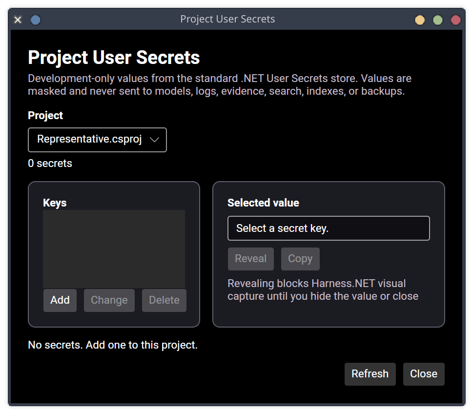

# Project User Secrets acceptance — 2026-08-13

This record covers Task 049 criterion 8 and
[ADR 022](../decisions/022-project-user-secrets.md).

## Delivered behavior

- A trusted workspace exposes **Project User Secrets** from the command palette and
  workspace overview. The dialog discovers only projects from bounded .NET project
  inspection.
- A project is available only when its project file has one unconditional literal
  `UserSecretsId`. Missing, conditional, computed, ambiguous, invalid, or symbolic
  metadata fails closed. Harness.NET neither evaluates MSBuild nor changes a project
  to initialize it.
- Data Access resolves the standard Linux or Windows per-user path behind a replaceable
  platform contract. It reads nested string objects and flattened keys, rejects
  unsupported JSON without rewriting it, and atomically writes the flattened shape
  used by `dotnet user-secrets` after mutation. Input and file sizes are bounded.
  Linux store files use owner read/write permissions.
- Listing returns project status and sorted keys only. Reveal, copy, add, change, and
  delete are separate Business Logic methods and separate named UI controls. Add does
  not overwrite, while change and delete require an existing key.
- Values are masked by default. Reveal returns a disposable disclosure instead of
  publishing a value through `AvaloniaPresentationStore`. Selection change, Hide, or
  window close disposes it. Copy obtains one transient value for the desktop clipboard.
  Secret-bearing semantic values redact their string representation.
- A singleton privacy guard makes portal capture and secret disclosure mutually
  exclusive from operation start through completion. Capture returns
  `sensitive_content_visible` without opening the portal while a value is revealed;
  reveal waits for an active capture to finish.
- Project secret values remain outside repositories, SQLite, application backup,
  logs, evidence, search, semantic indexes, prompts, role tools, and inbound MCP. No
  generic agent secret-read tool was added.

## Deterministic evidence

- `dotnet test Harness.slnx --no-build --no-restore` passed all 703 tests.
- `./eng/verify-editor-intelligence.py --no-build`, the production AT-SPI gate,
  and the Linux x64 publish gate passed with zero build warnings.
- `ProjectUserSecretStoreTests` cover standard nested reads, redacting result text,
  flattened atomic add/change/delete behavior, Linux file permissions, project-ID
  rejection, and malformed-store preservation.
- `ProjectUserSecretsServiceTests` cover trusted project scoping, metadata-only lists,
  separate mutations, transient copy, redaction, and disclosure/capture exclusion.
- `VisualCaptureServiceTests` prove a revealed secret rejects capture before portal
  invocation and capture succeeds after disposal.
- `ProjectUserSecretsDialogTests` use the real headless controls to prove masked
  defaults, five distinct accessible actions, local reveal, and close-time disposal.
- The production AT-SPI gate opens the command through the real command palette and
  verifies every named control. The captured production dialog is shown below.

## Remaining Task 049 work

- a real debugger adapter for Debug CodeLens;
- final correctness, latency, memory, cancellation, large-solution, repeated-context,
  IME, Orca, scaling, restoration, and Linux publication audit.
