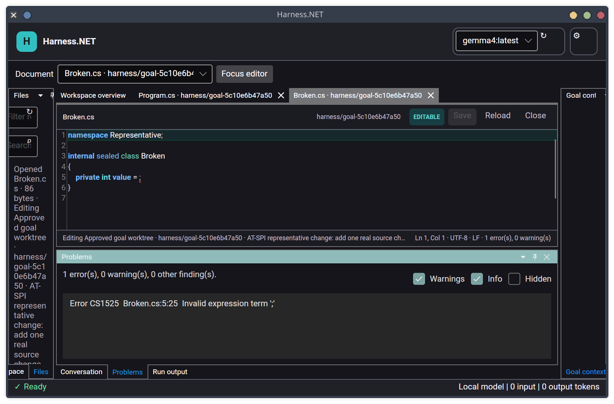
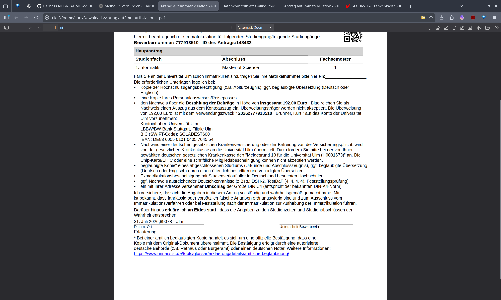

# Roslyn live diagnostics acceptance — 2026-07-31

This checkpoint exercises the Avalonia host on Linux against a temporary .NET 10 Git
repository and an approved goal worktree. The repository
contains one C# syntax error. No model provider or package restore is invoked.

## Wide review

At 1600×1000 window pixels, the active source document retains useful editor height
while the dockable Problems tool shows the exact compiler ID, repository-relative
path, one-based line/column, and bounded message. The editor footer reports the same
error/warning totals and a red inline squiggle marks the version-matched range. Error,
warning, information, and hidden severities remain distinct; hidden findings are off
by default, with accessible filters for users who need them.

## Compact review

At 900×650 window pixels, editor actions, source, code-health status, severity filters,
and the selected Problems row remain readable without overlap. Problems is a normal
Dock tool, restores from compact mode with Ctrl+Shift+M, and survives layout capture.
Selecting a row opens its source context and moves the caret to the exact range.

## Responsiveness and lifecycle evidence

`RoslynCodeIntelligenceEngineTests.Actual_harness_workspace_meets_the_bounded_foreground_session_budget`
ran against the real `Harness.slnx` on the Linux acceptance machine with .NET SDK
10.0.201. The observed foreground-session measurements were:

| Measurement | Observed |
|---|---:|
| Cold solution load and compilation warm-up | 7,244 ms |
| Warm changed-buffer diagnostic update | 1,190 ms |
| Retained managed memory over pre-session baseline | 89.7 MiB |
| Already-cancelled diagnostic request | 1.9 ms |

The deterministic Business Logic race test independently proves that an older
in-flight response becomes `Stale` after a newer buffer version is submitted. The
real adapter tests prove exact-baseline rejection, context invalidation, malformed
project degradation, and no implicit restore. The bounds are intentionally generous
for CI variance: 60 seconds cold, 15 seconds warm, 1 GiB retained, and 1 second for an
already-cancelled request.

## Repeatable evidence

`python3 eng/capture-source-editor.py` builds and launches the application, enables
AT-SPI, creates and trusts a temporary repository, approves a real isolated goal
worktree, opens the invalid C# document, waits until AT-SPI exposes its `CS1525`
problem, and captures both sizes. It now selects the Harness.NET window by exact title
so another window containing the repository name cannot be captured accidentally.

`Harness.Presentation.Avalonia.Tests` has 92 passing tests at this checkpoint. Its
diagnostics acceptance test verifies buffer version 1, inline-renderer attachment,
Problems content/status, the durable seventh tool, and exact caret navigation. A clean
solution build and the architecture boundary test complete with zero warnings. The
full `./eng/verify-avalonia-atspi.py` workflow also passes through trust,
goal approval, source/search, layout restart, and corrupt-layout recovery; its search
field and action now have distinct accessible names.
