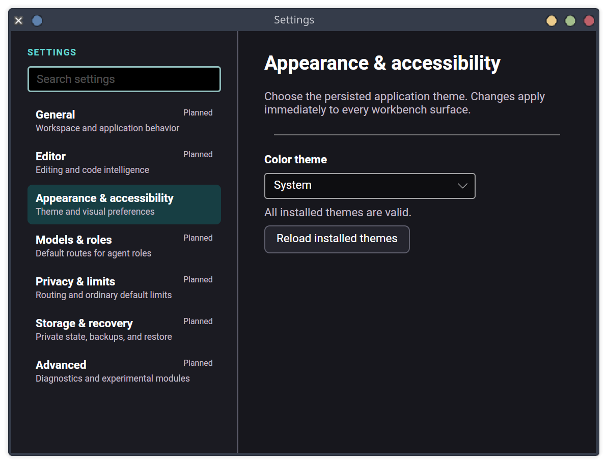

# Settings foundation acceptance — 2026-07-29

Task 040's first increment was inspected in the production Avalonia host with isolated
XDG configuration/data/state/cache directories. No workspace, model, provider call, or
remote spend was used.

## Hands-on review

- The header's Settings action opened the same focused surface exposed by application
  navigation, the command palette, and `Ctrl+,`.
- The 980×700 logical-pixel window kept all seven stable categories visible, with a
  strong selected state and honest **Planned** labels for categories that do not yet
  have persisted contracts.
- Appearance loaded the real built-in theme catalog through `IAppearanceService`.
  Theme choice, validation status, and reload are visually grouped without crowding
  the workbench header.
- AT-SPI exposed **Search settings**, **Settings categories**, and **Preferred color
  theme** from the production process before capture.
- The search vocabulary is covered by a deterministic presentation test, including
  category names and related terms such as `contrast`, `reviewer`, and `backup`.

## Repeatable evidence

Run `python3 eng/capture-settings.py` in a graphical Linux session. The script builds
and launches the real host against temporary private state, opens Settings through
AT-SPI, verifies the representative accessible controls, captures the active window,
and removes the temporary state on exit.
