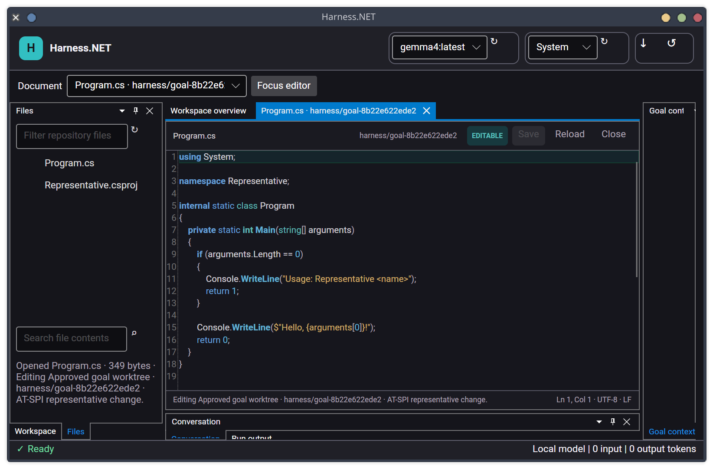
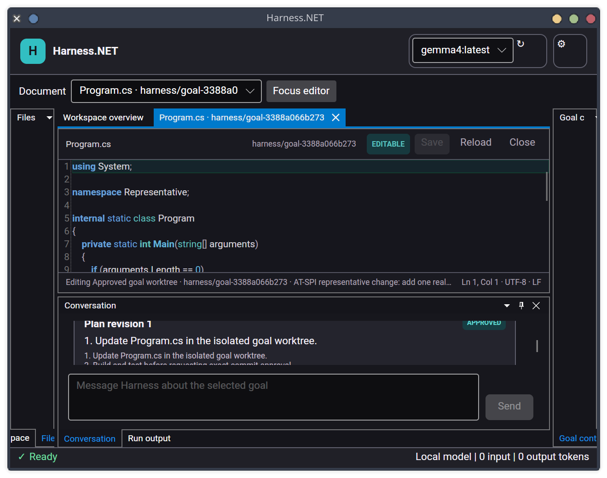

# Source editor acceptance checkpoint — 2026-07-29

This checkpoint records the Avalonia host on Linux against a temporary
real .NET 10 Git repository. The workflow registers and trusts the repository,
creates a durable goal and manual plan, explicitly approves its isolated worktree,
and opens `Program.cs` through the Business Logic document
boundary. It invokes no model provider.

## Wide review

At 1600×1000 window pixels, the source document keeps the tracked Files tool, central
editor, goal context, Conversation, and Run output available together. The editor
surface now presents:

- a repository-relative breadcrumb and exact approved goal branch;
- an **EDITABLE**, **READ ONLY**, or **TRUNCATED** access badge;
- compact Save, Reload, and Close actions with Ctrl+S/Ctrl+W tooltips;
- a dedicated code surface with current-line emphasis, line numbers, rectangular
  selection, and scroll-below-document behavior;
- theme-aware C# keyword, type, method/number, string, comment, preprocessor, and
  punctuation colors instead of AvaloniaEdit's unreadable light-theme defaults; and
- a compact status bar with the durable access description, caret line/column,
  selection length, UTF-8, and detected LF/CRLF/mixed/no-line-break state.

## Compact review

At 900×650 window pixels, Dock collapses the side tools to their chrome and preserves
the active source document. The breadcrumb yields space first, while branch, access,
Save/Reload/Close, code, and caret/format status remain readable and do not overlap.
The Conversation tool remains keyboard-restorable below the editor.

## Repeatable evidence

`./eng/capture-source-editor.py` reproduces both images through the real Linux host,
AT-SPI actions, a temporary repository, and isolated XDG directories. It performs no
inference and removes its temporary repository and application state.

`Harness.Presentation.Avalonia.Tests` verifies editor interaction defaults, accurate
original/approved-worktree access state, breadcrumb/context text, current caret and
line-ending status, exact-baseline save, dirty-document decisions, theme refresh,
compact rendering, focus, scaling, and layout recovery. All 82 tests pass.

`./eng/verify-avalonia-atspi.py` passes against the application after this change,
including repository trust, goal/plan approval, editable source, multi-document
switching, search, restart/layout restoration, and corrupt-layout fallback. A clean
solution build completes with zero warnings.

At this dated checkpoint, semantic highlighting, diagnostics, completion, and
refactoring were not implemented. Tasks 042–044 added them later.

## User-directed editing amendment — 2026-08-08

Files explicitly opened from the active trusted original workspace now enter the
same editor by default; creating an agent goal is not required for a
manual user edit. The save request carries the registered workspace identity, relative
path, exact loaded SHA-256, and UTF-8 content through Business Logic to the confined
atomic file editor. Trust is revalidated at save time. An inactive or newly untrusted
workspace is rejected before file access, and an external hash change retains the
existing reload/overwrite/cancel conflict flow. Truncated files remain read-only.

Approved-goal documents are unchanged: they resolve to the isolated worktree and save
through the durable goal mutation/evidence boundary. Presentation coverage proves an
original-workspace tab is labelled **EDITABLE**, accepts text, and emits a goal-free
workspace-bound save; Business Logic coverage proves successful exact-baseline save
and fail-closed trust revocation. No model provider, network operation, or paid check
is involved.
