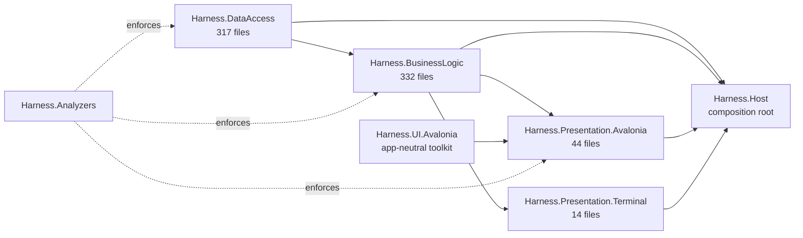

# Architecture

This is the system map. The engineering rules live in [framework.md](framework.md);
binding decisions live in [the decision records](decisions/README.md). Measured
figures in this document are dated 2026-08-24 (commit `16f3085`); re-measure before
relying on them.

## Projects and references

Harness.NET is a single-process modular application.

- Data Access contains persistence and external adapters and defines upward
  contracts.
- Business Logic contains policy, use cases, and workflow state.
- Presentation contains Avalonia and Terminal.Gui adapters and no business rules.
- `Harness.UI.Avalonia` contains app-neutral Avalonia controls and themes and
  references no Harness runtime project.
- Host is the composition root and the only project that references every layer.
- The analyzer project enforces reference direction and public boundary shape at
  compile time; `Harness.Architecture.Tests` re-asserts the project-reference graph.

Only interfaces, records, and enums cross runtime layer boundaries. Prefer enums for
closed sets and single-value records for values with distinct domain meaning.
Implementations remain internal except where DI construction requires visibility.

Provider and MCP SDK types remain in Data Access. Microsoft Agent Framework types
remain behind the Business Logic role interface. Roslyn, MSBuild, and future LSP
types remain in the code-intelligence adapter.

## Module map

Both runtime layers are organized as feature namespaces. Business Logic and Data
Access average roughly 70–90 lines per file; the granularity problem is confined to
the Avalonia Presentation layer and is being addressed under
[ADR 025](decisions/025-workbench-composition-and-refactor-guardrails.md) /
[the refactor baseline](refactor-baseline.md).

| Feature area | Business Logic | Data Access |
|---|---|---|
| Agents, roles, tools | `Agents` (48), `Tools` (1) | `Agents` (8), `Tools` (1) |
| Goals, plans, approvals | `Goals` (33), `Approvals` (11) | `Goals` (15), `Approvals` (7) |
| Workflow execution | `Workflows` (33), `Acceptance` (20), `Operations` (16) | `Workflows` (26), `Commits` (22), `Worktrees` (4) |
| Workspace and Git | `Workspaces` (12), `Inspection` (23) | `Workspaces` (6), `Inspection` (28) |
| Code intelligence | `CodeIntelligence` (11), `Mutations` (10), `Editor` (2) | `CodeIntelligence` (23), `Mutations` (6), `Editor` (4) |
| Models and providers | `Costs` (7) | `Models` (42, Ollama/OpenRouter subtrees) |
| Retrieval and research | `Retrieval` (26), `Research` (5) | `SemanticIndex` (15), `Research` (8) |
| MCP | `Mcp` (7) | `Mcp` (8) |
| Persistence and state | `Layouts` (6), `Documents` (9) | `Persistence` (22), `Conversations` (4), `Layouts` (6) |
| Evidence and capture | `Evidence` (11), `VisualCapture` (2), `Dashboard` (8) | `Evidence` (7), `VisualCapture` (7), `Observability` (3) |
| Settings and platform | `Appearance` (14), `Framework` (11), `ProjectSecrets` (2), `Privacy` (2), `Execution` (2) | `Appearance` (11), `Framework` (7), `Configuration` (3), `Secrets` (6), `ProjectSecrets` (3), `Execution` (9) |

Contract surface: 67 public interfaces in Data Access, 50 in Business Logic. No
public class exists in either runtime layer — the boundary-shape rule holds with
zero exceptions.

## Coupling topology

Measured intra-layer coupling in Business Logic has a deliberate two-tier shape:

- **Shared identifier kernel.** Semantic value records and enums (`GoalId`,
  `WorkspaceId`, `ToolCorrelationId`, spend modes, …) are referenced freely across
  features. `GoalId` appears in 78 files outside `Goals`; the most-imported
  namespaces (`Goals` 49, `Workspaces` 20, `Tools` 16) are imported almost entirely
  for these value types.
- **Feature-local services.** Service interfaces stay inside their feature and are
  consumed by Presentation or Host, not laterally: `IGoalService` is referenced by
  only 3 Business Logic files outside its own namespace.

Keep it that way: cross-feature reuse of value contracts is free; a new lateral
service dependency between features is an architectural event that needs a reason.
`BusinessLogicServiceDependencyTests` pins the reviewed inventory of 36 existing
consumer-to-service edges and fails when a new edge appears without an explicit
inventory update.

## Translation boundary

Data Access defines upward contracts consumed by Business Logic. Business Logic
does not re-expose them: its public surface presents Business-Logic-defined records
and enums, translating at the service implementation. As a result, 27 record
families exist deliberately in both layers under the same name
(`DeveloperGitPath`, `DeveloperGitStateFingerprint`, `ApplicationBackupResult`,
`ToolCorrelationId`, …). This is an anti-corruption boundary, not accidental
duplication: it keeps Presentation unable to name Data Access types (verified: zero
`Harness.DataAccess` usings across all Presentation projects) and lets each layer
version its contracts independently.

Costs, accepted: mirror records plus mapping code, and name collisions at the
composition root, which Host resolves with using-aliases
(`OperationsBackupResult = Harness.BusinessLogic.Operations.ApplicationBackupResult`).

Six Business Logic files import Data Access namespaces inside contract-bearing
files (`AgentToolExposureSettingsService`, `AgentToolActivationService`,
`InboundMcpApplicationService`, `InboundMcpSettingsService`,
`EditorIntelligenceSettings`, `KeybindingSettings`). Spot checks show the imports
serve internal implementation, and public signatures expose Business Logic types.
`HARNESS003` now walks every reachable public-signature type and rejects a Data
Access leak at error severity. The six imports above compile under that rule and
therefore remain implementation-only.

## Composition root

`Harness.Host` composes everything. `Program.cs` is a 179-line orchestrator retaining
configuration loading, registration order, observability bootstrap, run-mode
resolution (Avalonia, Terminal, or isolated MCP evaluation via
`--mcp-evaluation-root`), and shutdown ownership. Its 140 DI registrations live in
five internal modules: Infrastructure, Integrations, Workspace, Goals, and
Presentation. Architecture tests enforce the 200-line entry-point budget. Host tests
compare the combined service-type/key/lifetime inventory to the reviewed 138-entry
pre-split baseline at commit `16f3085`, then separately assert Task 071's two reviewed
singleton additions: the session activity owner and its read-only Presentation
boundary.

## Core records

| Record | Meaning |
|---|---|
| Workspace | Registered Git repository, selected .NET entry point, trust, and private settings. |
| Framework | Layered rules, locks, and procedures. |
| Goal | User outcome, role routes, spend mode, and review limit. |
| Plan | Ordered bounded tasks that require approval before mutation. |
| Run | One checkpointed goal attempt. |
| Task | One delegated unit with file areas and acceptance criteria. |
| Artifact | Patch, plan, report, decision, or verification result. |
| Approval | Typed authority for an exact consequential action. |
| Evidence | Diff, diagnostic, Build/Test, review, usage, visual capture, or tool result. |
| Source context | Trusted original workspace or approved goal worktree plus entry point and identity. |

## Request flow

1. Presentation sends a record command to Business Logic.
2. Business Logic validates state and authority.
3. Data Access performs database, provider, filesystem, Git, Roslyn, process, MCP,
   documentation, package-registry, or platform work and returns Harness records.
4. Business Logic persists the completed boundary and advances state.
5. Presentation refreshes correlated state.

Long-running operations accept cancellation. Persist a completed tool result before
the next model call. Mark interrupted calls uncertain and do not replay them.

Editor buffers are transient. Presentation sends immutable context-, baseline-, and
version-bound text. Business Logic validates context. Data Access computes semantic
results. Presentation discards stale context or buffer versions. Roslyn does not run
on the UI thread.

Reactive state lives at the Presentation boundary: the Avalonia store reduces one
`AvaloniaShellState` behind an Rx `BehaviorSubject`. Business Logic and Data Access
are async-first (`Task`/`ValueTask` with `CancellationToken`), not stream-based;
Rx appears below Presentation only where a contract genuinely models a stream.

## Storage

- XDG configuration: provider/MCP modules, documentation/package sources, framework
  settings, and themes.
- SQLite: goals, conversations, prompts, outputs, tools, approvals, checkpoints,
  usage, artifacts, vectors, summaries, overlays, and preferences — 30 sequential
  DbUp migrations, Dapper, explicit SQL.
- XDG state: logs, worktree state, workbench layout, and private bounded visual captures.
- XDG cache: disposable documentation evidence keyed by source, version, query, schema,
  and privacy mode.
- Linux Secret Service: credentials, with configured environment fallback.
- User repository: goal branches and user-approved source or existing guidance only.

Harness.NET does not create a metadata directory in a user repository.

## Agent authority

Lead reads the trusted original workspace and cannot mutate it. Implementer reads and
writes only an approved goal worktree and delegated file areas. Reviewer reads the
same worktree and evidence but cannot write, Build, or Test.

The workflow, rather than either model role, owns the deterministic Build/Test gate
after all delegated implementation tasks and after each review correction. Every
changed implementation state is validated before independent review. One failed gate
may authorize one bounded Implementer repair against the cited diagnostics;
persistent failure becomes explicit retryable direction. Reviewer decisions require
typed diff and evidence inspection, with one in-session correction for a text-only
response.

Agents receive typed tools, not shell strings. Paths are canonicalized and confined.
Restore, package work, commit, external access, and destructive operations remain
separate authority decisions.

Model-authored compiler-managed changes are applied to an in-memory solution first.
New compiler errors block the write. Warnings and analyzer findings become evidence.
Accepted multi-file changes use exact baselines and atomic writes, followed by
validation. Semantic rename uses Roslyn symbol identity and a preview fingerprint.
Manual editing remains permissive.

## Models and tools

Business Logic maps Microsoft tool declarations and messages to provider-neutral
records. Data Access serializes Ollama or OpenRouter requests.

Reasoning text and optional protected provider JSON cross through Harness records.
The Agent Framework carries protected data between tool calls. Ollama receives prior
thinking and named tool results; OpenRouter receives `reasoning_details`. Completed
streamed tool calls are emitted once.

Remote cost estimates include messages and tool schemas. OpenRouter reserves cost
before a call and reconciles returned cost. Every call remains attributed to goal,
role, provider, model, and operation.

Semantic retrieval is bound to the role’s active source context, a 1–8 result limit,
and the goal’s privacy and spending policy.

MCP transport and SDK mapping stay in Data Access. Business Logic exposes only
enabled tools that explicitly declare read-only and non-destructive behavior.

The Business Logic research manager owns documentation lookup order, sufficiency,
ranking, citations, version matching, cache freshness, offline behavior, and bounded
context. Data Access owns exact package/SDK files, configured index roots, MCP mapping,
HTTPS search, NuGet v3 metadata, and cache files. Documentation is requested through a
typed operation; it is not added to routine prompts.

Dependency evidence comes from project and central package XML, NuGet lock files, and
existing restored assets. Inspection does not run Restore or project targets. Exact
candidate validation reports incomplete registry facts as unknown. Business Logic
generates stable CycloneDX JSON from the resolved graph and owns package/SBOM previews.
The Data Access exporter writes only an explicitly selected destination.

Visual capture policy stays in Business Logic. The Linux Data Access adapter uses
only the XDG Screenshot portal for a single interactive frame. Presentation supplies
application context and UI scale, renders the exact stored bytes, and never invents
window or display identity omitted by the portal. Remote inspection requires a
separate saved opt-in.

## Platform boundary

Linux is the release target. Presentation owns windows, pickers, clipboard,
notifications, shortcuts, screen geometry, and accessibility. Data Access owns XDG,
filesystem, Secret Service, process behavior, and the replaceable Linux portal
adapter. Host composes these focused capabilities. Business Logic contains no
platform checks.

## Enforcement matrix

Each architectural rule with its enforcement mechanism and current status. A rule
enforced only by review is a gap, not a guarantee.

| Rule | Mechanism | Status |
|---|---|---|
| Layer reference direction | `HARNESS001` (semantic, error) + `LayerReferenceTests` | Enforced |
| Public boundary types are interface/record/enum | `HARNESS002` (error) | Enforced; verified zero exceptions |
| Presentation cannot name Data Access types | `HARNESS001` | Enforced; verified zero usings |
| Nullable + warnings as errors | `Directory.Build.props` | Enforced |
| UI toolkit references no runtime layer | `HARNESS001` + reference tests | Enforced |
| Business Logic public surface exposes only Business Logic types | `HARNESS003` (semantic, error) | Enforced |
| Cross-feature service coupling is explicitly inventoried | `BusinessLogicServiceDependencyTests` | Enforced; 35 reviewed edges |
| Production and test source-size budget | `SourceSizeBudgetTests` | Enforced; shrink-only legacy allowlist |
| Host entry point stays at or under 200 lines | `SourceSizeBudgetTests` | Enforced |
| Semantic types over primitives | review | Convention (deliberate; subjective calls stay human) |
| No unrestricted shell; typed tools only | code shape + review + model-input rejection (`WorkspaceMutationService`) | Structural, partially enforced |
| Migration ordering and idempotent startup | DbUp sequential scripts + tests | Enforced |

## Required checks

- architecture analyzer and architecture tests;
- nullable and warnings-as-errors build;
- deterministic domain tests without providers or UI;
- focused adapter integration tests;
- explicit opt-in for live providers and paid requests;
- redacted logs and telemetry without model content by default;
- cancellation and stale-state tests for long-running work;
- atomic workflow and cost reconciliation where state consistency requires it.
